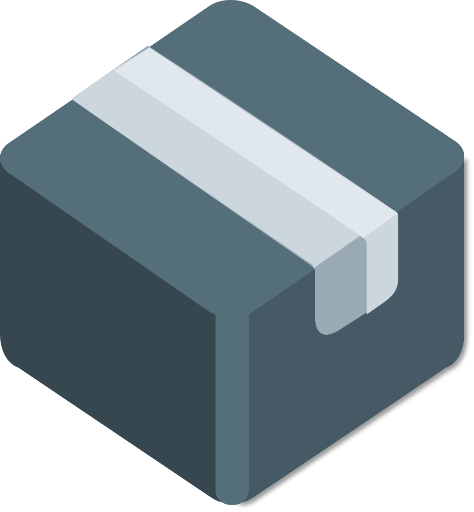
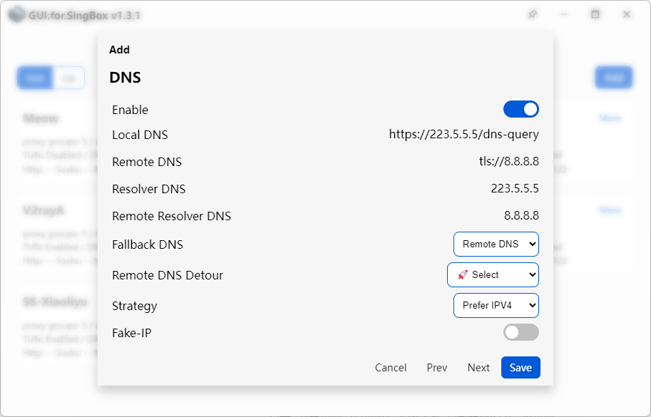
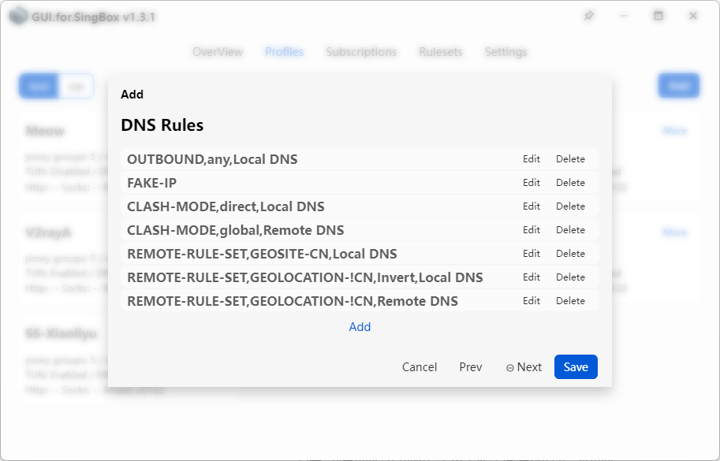
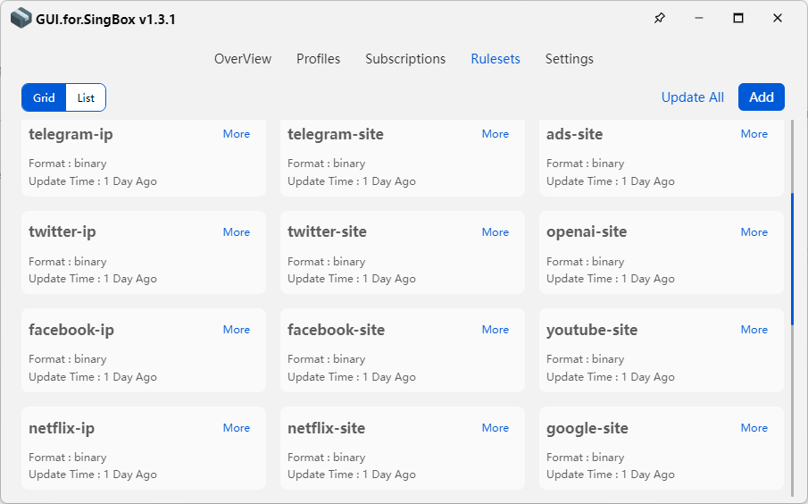

<div align="center">
  
  <h1>GUI.for.SingBox</h1>
  <p>A GUI program developed by vue3 + wails.</p>
  
</div>

## Preview

<div align="center">
  
  <br/>
  
  
  <br/>
  
  
</div>

## Build

1、Build Environment

- Node.js [link](https://nodejs.org/en)

- pnpm ：`npm i -g pnpm`

- Go [link](https://go.dev/)

- Wails [link](https://wails.io/) ：`go install github.com/wailsapp/wails/v2/cmd/wails@latest`

2、Pull and Build

```bash
git clone https://github.com/GUI-for-Cores/GUI.for.SingBox.git

cd GUI.for.SingBox

wails build -m -trimpath
```

## Stargazers over time

[](https://starchart.cc/GUI-for-Cores/GUI.for.SingBox)
